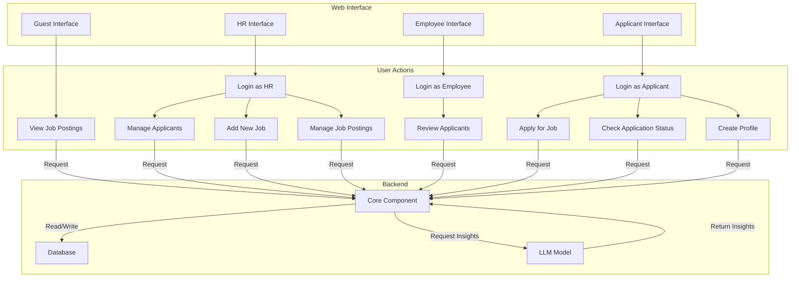

# Architecture

## System Overview

```mermaid
graph TD
    subgraph Web Interface
        Guest[Guest Interface]
        HR[HR Interface]
        Employee[Employee Interface]
        Applicant[Applicant Interface]
    end

    subgraph Backend
        Core[Core Component]
        DB[Database]
        AI[LLM Model]
    end

    subgraph User Actions
        A1[Login as HR]
        A2[Login as Employee]
        A3[Login as Applicant]
        A4[Manage Applicants]
        A5[Review Applicants]
        A6[Apply for Job]
        A7[Check Application Status]
        A8[Add New Job]
        A9[Manage Job Postings]
        A10[Create Profile]
        A11[View Job Postings]
    end

    Guest --> A11
    HR --> A1
    Employee --> A2
    Applicant --> A3

    A1 --> A4
    A1 --> A8
    A1 --> A9
    A2 --> A5
    A3 --> A6
    A3 --> A7
    A3 --> A10

    A11 -->|Request| Core
    A4 -->|Request| Core
    A5 -->|Request| Core
    A6 -->|Request| Core
    A7 -->|Request| Core
    A8 -->|Request| Core
    A9 -->|Request| Core
    A10 -->|Request| Core

    Core -->|Read/Write| DB
    Core -->|Request Insights| AI
    AI -->|Return Insights| Core
```

TODO...
